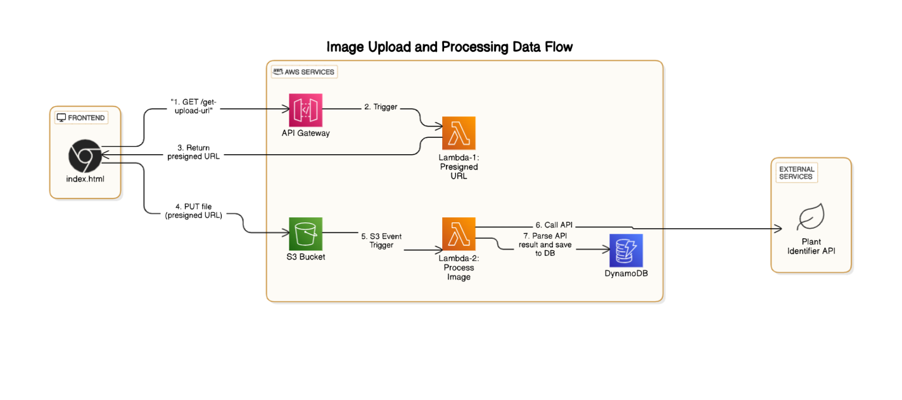

# 🌿 Image-Based Plant Identifier

A serverless web app to upload plant images, identify plants using the [plant.id API](https://web.plant.id/), and store identified plant information in DynamoDB. Entirely built using AWS services.

---

## 📸 How It Works

1. **Frontend (index.html)** requests a **presigned URL** via **API Gateway → Lambda-1**.
2. **Lambda-1**:
     - Parse query string param: ?filename=xyz
     - Encode the filename to make it URL-safe
     - Generate the presigned URL with a 5-minute expiration
     - Return the URL along with CORS headers for frontend access     
4. The **presigned URL** is returned and used by the frontend to upload the image **directly to an S3 bucket**.
5. **S3 triggers Lambda-2** automatically after an image upload.
6. **Lambda-2**:
    - Get bucket and image key from S3 event
    - Read image content from S3
    - Calls the **Plant Identifier API** with the uploaded image.
    - Parses the returned plant details.
    - Stores these details into **DynamoDB**.
---

## 🛠️ Tech Stack

-AWS S3     
-AWS API Gateway     
-AWS Lambda     
-AWS DynamoDB     
-Plant.id API        

---

## 🗺️ Architecture Diagram

---

## 🚀 Deployment Steps

1. Upload `index.html` to an S3 bucket (enable **Static Website Hosting**).
2. Create **API Gateway** ➔ **Lambda-1** to generate presigned URLs.
3. Set proper **CORS settings** for API Gateway and S3 bucket.
4. Create **S3 Event Trigger** to invoke **Lambda-2** after file upload.
5. In **Lambda-2**:
    - Fetch the uploaded image.
    - Send the image to **Plant Identifier API**.
    - Save returned plant name/details into **DynamoDB**.
6. Create a DynamoDB table to store the result 

---

